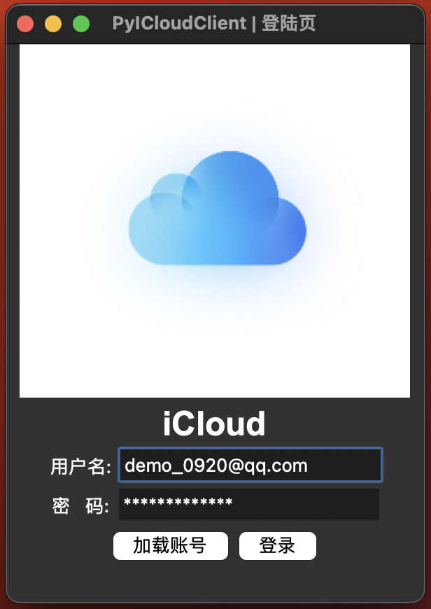

# <cite>iCloud Console</cite> 
<p align="center">
    
</p>

[English](README.md) | 简体中文 


|  |  |
|:--------------------------------------------------------:|:--------------------------------------------------------------:|
|                        *主页和交互预览*                         |                            *登录页预览*                             |


## Usage
```shell
Usage: icloud.py [OPTIONS] COMMAND [ARGS]...

Options:
  -u, --username <username>  Your iCloud username or email address  [required]
  -p, --password <password>  Your iCloud password (default: use PyiCloud
                             keyring or prompt for password)  [required]

  --china-account            Specify the "HOME_ENDPOINT" and "SETUP_ENDPOINT"
                             for the "China Mainland Accounts".

  --version                  Show the version and exit.
  --help                     Show this message and exit.

Commands:
  device          Device and Location, Find device Location, Get device...
  photo-download  Manage Photos on your icloud.
  test            Do some experimental tes.
```
##  Photos Download （2FA）
```shell
Usage: icloud.py photo-download <options>

Options:
  -d, --directory <directory>    Local directory that should be used for
                                 download

  --recent INTEGER RANGE         Number of recent photos to download (default:
                                 download all photos)

  --auto-delete                  Scans the "Recently Deleted" folder and
                                 deletes any files found in there. (If you
                                 restore the photo in iCloud, it will be
                                 downloaded again.)

  --modify-olds                  Modify the "Created Time" of the old files
                                 that already been in the folder.

  --workers INTEGER RANGE        Number of the thread to download
                                 photo.(Default is 3)

  --transfer-album <album_name>  Determine the album that will be downloaded.
  --help                         Show this message and exit.
```
示例1
```shell
icloud -d /external/SADAM/icloud/photos/ --recent 500
```
示例2
```shell
icloud -u <username> -p <password> -d /external/SADAM/icloud/photos/ --recent 500
```
示例3
```shell
icloud -u <username> -p <password>
--china-account
photo-download
-d
/Volumes/share/SADAM/icloud/photos
--transfer-album
Hidden
--modify-olds
--auto-delete
--workers
1
```
### 通过crontab 每隔半个小时自动启动
```shell
*/30 * * * * /<python绝对路径>/python3.9 /<项目绝对路径>/icloud.py -u <icloud账号> -p <密码> --china-account photo-download -d /external/SADAM/icloud/photos/ --transfer-album Transfer --auto-delete >> /opt/icloud-killer/logs/last-$(date "+%Y%m%d%H%M").log 2>&1
```

##  Driver And Files (2FA)


##  Reminds (2FA)

##  Contact (2FA)


##  Device And Location (Weak 2FA: Just send)
* Get device info.
  * location
  * Status
  * Battery level
  * Device model
  * Device name
  * Device ID
* Remote Control
  * locking device
  * Show message
  * Play sound

```python
api.iphone.location()
```

```json
{
  'isOld': True,
  'isInaccurate': False,
  'positionType': 'Wifi',
  'secureLocation': None,
  'secureLocationTs': 0,
  'altitude': 0.0,
  'latitude': 43.894873066105184,//纬度
  'longitude': 87.58595865485619,
  //经度
  'horizontalAccuracy': 65.0,
  //水平精度
  'verticalAccuracy': 0.0,
  //垂直精度
  'timeStamp': 1670048465162,
  //时间戳
  'floorLevel': 0,
  'locationType': '',
  'locationFinished': True,
  'locationMode': None
}
```
## 开发计划
* [ ] 实现按照不同的排序展示Assets.
* [ ] 实现便于小白用户操作的可视化GUI界面(不用搭建环境, 下载对应平台的Release即可能用, 命令行功能依然保留).
* [ ] 实现可一键迁移Assets到Immich的功能.

## Star History

<a href="https://star-history.com/#haoke98/icloud-killer&Date">
  <picture>
    <source media="(prefers-color-scheme: dark)" srcset="https://api.star-history.com/svg?repos=haoke98/icloud-killer&type=Date&theme=dark" />
    <source media="(prefers-color-scheme: light)" srcset="https://api.star-history.com/svg?repos=haoke98/icloud-killer&type=Date" />
    
  </picture>
</a>

## 存在的问题:
* Missing apple_id field
  * 详细报错信息:
    ```shell
    Traceback (most recent call last):
      File "test.py", line 10, in <module>
        api = PyiCloudService("***", "***")
      File "/usr/local/lib/python3.9/site-packages/pyicloud/base.py", line 268, in __init__
        self.authenticate()
      File "/usr/local/lib/python3.9/site-packages/pyicloud/base.py", line 328, in authenticate
        self._authenticate_with_token()
      File "/usr/local/lib/python3.9/site-packages/pyicloud/base.py", line 350, in _authenticate_with_token
        raise PyiCloudFailedLoginException(msg, error)
    pyicloud.exceptions.PyiCloudFailedLoginException: ('Invalid authentication token.', PyiCloudAPIResponseException('Missing apple_id field'))
    ```
  * 解决方案: 
    * [Apparently `apple_id` and `password` are now required on method:`_authenticate_with_token`](https://github.com/picklepete/pyicloud/issues/349#issuecomment-943885985)

## 相关链接

1. [PyiCloud PyPI Home Page](https://pypi.org/project/pyicloud/)
2. [PyiCloud GitHub Home Page](https://pypi.org/project/pyicloud/) 
